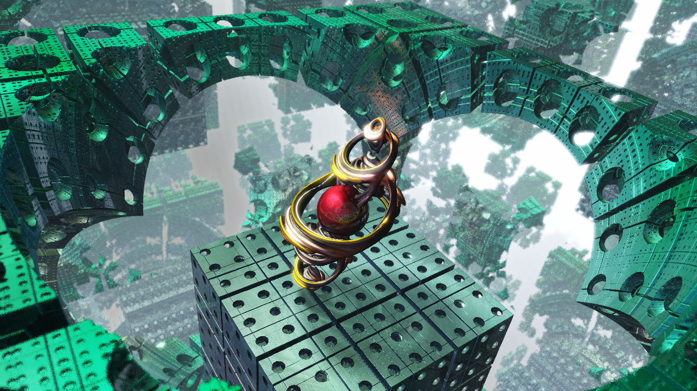

# ThirdRayTrace

## これは何??

[レイトレ合宿4!?](https://sites.google.com/site/raytracingcamp4/)への応募作品です。

レイマーチングによるごく簡単なレンダリング。GPUが使えなかったので全てCPUで実装しました。

## ビルド環境

clangとかgccとかでビルドできると思います。必要なライブラリは全て同梱してあります。

## 使用したライブラリ

+ glm 0.9.7.6
+ picojson
+ stb

## License

License All source code files are licensed under the MPLv2.0 license

[MPLv2.0](https://www.mozilla.org/MPL/2.0/)
